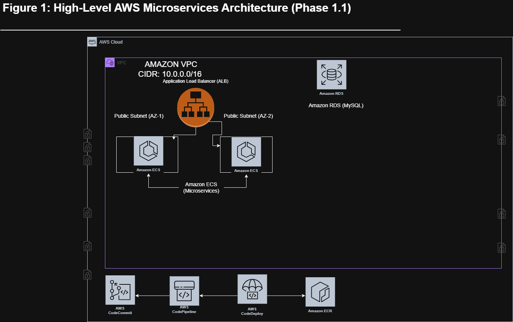
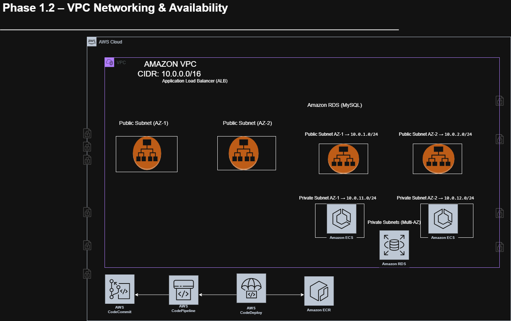

# AWS Microservices CI/CD Pipeline
Production-style microservices architecture demonstrating service decomposition, container orchestration, and automated deployment pipelines on AWS.

## Overview

This is a **Node.js microservices** project with two services:

- **customer-service** runs on port **3000** (public supplier views and APIs).
- **employee-service** runs on port **3001** (admin supplier management).

The stack includes **Docker**, **Docker Compose**, and AWS: **ECS**, **ECR**, **CodeBuild**, **CodeDeploy**, and **CodePipeline** for container build and deployment.

Local helper scripts (PowerShell) are provided:

- `scripts/run-local.ps1` — build and start both services with Docker Compose
- `scripts/smoke-test.ps1` — hit all six endpoints and report PASS/FAIL
- `scripts/stop-local.ps1` — stop containers (`docker compose down`)


## Tech Stack

Node.js  
Docker  
Docker Compose  
AWS ECS  
AWS ECR  
Application Load Balancer  
AWS CodeBuild  
AWS CodeDeploy  
AWS CodePipeline  

## What This Demonstrates

- Microservices architecture design  
- Containerization with Docker  
- Infrastructure organisation for cloud deployments  
- CI/CD pipelines for automated deployments  
- AWS ECS container orchestration  
- Load balancing with Application Load Balancer  
- End-to-end system documentation

## Architecture

This project demonstrates the redesign of a monolithic Node.js supplier application into containerized microservices deployed on AWS using Amazon ECS, Amazon ECR, an Application Load Balancer, and automated CI/CD pipelines.

### Initial Architecture Planning

The initial architecture diagram shows the early system design and planning stage before the microservices deployment was finalized.



### Final AWS Microservices Architecture

The final architecture illustrates how the system runs on AWS using containerized services, load balancing, and CI/CD deployment pipelines.



In production, **customer-service** runs on port 3000 and **employee-service** on port 3001; both are containerized with Docker and run on Amazon ECS. An Application Load Balancer routes requests to the appropriate service by path. Deployments are automated via **CodePipeline** (orchestration) and **CodeDeploy** (ECS blue/green).

## Quick Start

From the repository root (Windows/PowerShell):

```powershell
# Start both services (build and run in background)
docker compose up --build -d

# Or use the helper script (same as above, then prints URLs)
.\scripts\run-local.ps1

# Verify all endpoints
.\scripts\smoke-test.ps1

# Stop services
.\scripts\stop-local.ps1
```

## Architecture Summary

The system follows a container-based microservices deployment model:

```
Client
   │
   ▼
Application Load Balancer
   │
   ├── customer-service (ECS task, port 3000)
   │
   └── employee-service (ECS task, port 3001)
```

CodePipeline orchestrates the CI/CD workflow:
**Source → CodeBuild → ECR → ECS deployment via CodeDeploy.**

Images are built from the services directories and stored in Amazon ECR.
ECS services pull images from ECR during deployments and register with the ALB target groups.

See `docs/ARCHITECTURE.md` for the full system diagram.

## Structure
- phase-1-architecture/ — Architecture diagrams and design decisions (Phase 1.1, 1.2, etc.)
- phase-2-monolith-analysis/ — Analysis + testing notes for the monolithic application
- phase-3-cloud9-setup/ — Cloud9 setup + source control actions (e.g., CodeCommit)
- phase-4-microservices/ — Microservices build-out and supporting infrastructure
- phase-5-ecr-deployment/ — ECR repositories and image push
- phase-6-ecs-cluster/ / phase-6-load-balancer/ — ECS and ALB
- phase-7-cicd-preparation/ / phase-7-ecs-deployment/ — ECS and deployment setup
- phase-8-cicd-pipeline/ — CI/CD pipeline
- phase-9-final-verification/ — Final verification

## Services
- customer-service
- employee-service

## Local Architecture
The application is split into two Node.js microservices:
- customer-service on port 3000
- employee-service on port 3001

## Docker Compose
Start both services with:

```
docker compose up --build -d
```

## Routes
- http://localhost:3000 — customer-service root
- http://localhost:3000/health — customer-service health
- http://localhost:3000/suppliers — customer-service suppliers
- http://localhost:3001 — employee-service root
- http://localhost:3001/health — employee-service health
- http://localhost:3001/admin/suppliers — employee-service admin suppliers

## Current Progress
- Microservices rebuilt locally
- Dockerfiles created
- Docker Compose configured
- Both services running successfully in containers

## Planned AWS Next Steps
- Add ECS task definitions
- Add ECR notes
- Add ALB routing notes
- Add CI/CD deployment structure
