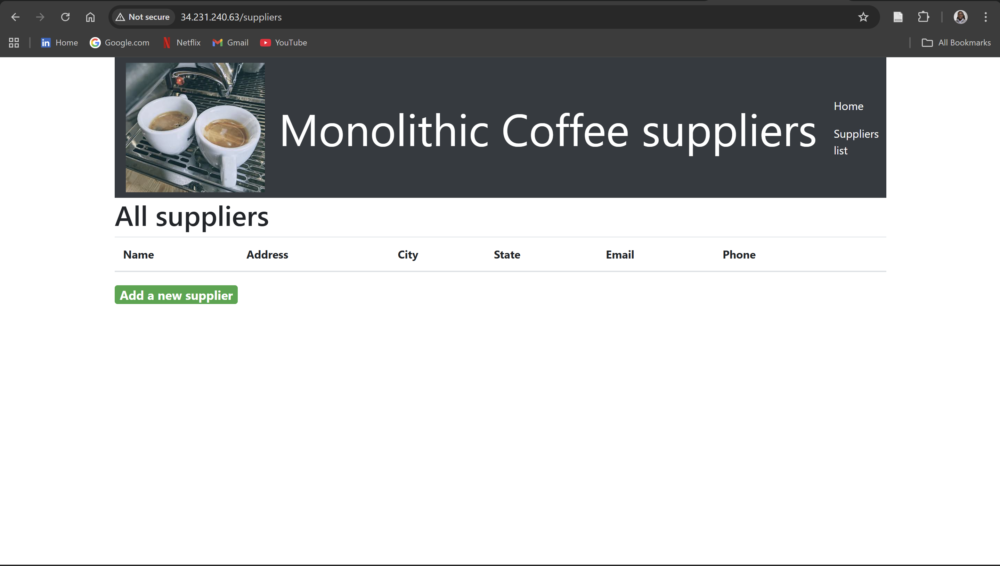

## Task 2.2 — Test the monolithic web application

### Objective
Test the core functionality of the monolithic Coffee Suppliers application and observe URL routes.

### Actions performed
- Navigated to the suppliers list page (/suppliers)
- Verified page rendering and navigation
- Confirmed application functionality from the public EC2 endpoint

### Key observations
- The application uses clear URL paths that map to features
- These routes will later become individual microservices

### Evidence

