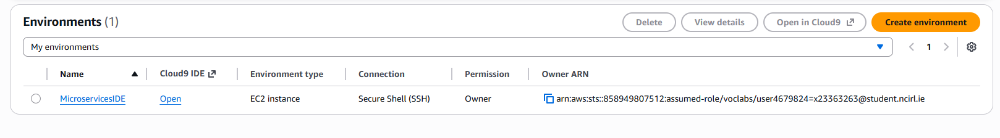
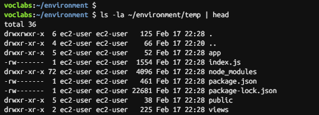
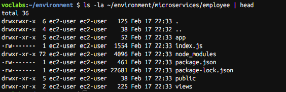

# Phase 3 — Cloud9 Setup & Git Integration

## Overview

In this phase, the development environment was created using AWS Cloud9.  
The monolithic Node.js application was copied into the environment, split into two microservices, and version-controlled using AWS CodeCommit.

---

## Task 3.1 — Create AWS Cloud9 Environment

A Cloud9 IDE named **MicroservicesIDE** was created with the following configuration:

- Instance Type: t3.small
- Platform: Amazon Linux 2
- Connection: SSH
- VPC: LabVPC
- Subnet: PublicSubnet1

This EC2-backed Cloud9 environment serves as the development and Docker build environment.



---

## Task 3.2 — Copy Application Code to Cloud9

The monolithic application source code was securely copied from the MonolithicAppServer EC2 instance using SCP.

Steps performed:

- Downloaded `labsuser.pem`
- Set correct permissions using `chmod`
- Created `/environment/temp`
- Retrieved private IP of MonolithicAppServer
- Used SCP to copy application source files



---

## Task 3.3 — Create Microservices Working Directories

The application was split into two separate working directories:

- `/microservices/customer`
- `/microservices/employee`

Each directory contains a full copy of the monolithic application source code.

The temporary directory was removed after verification.



---

## Task 3.4 — Create CodeCommit Repository & Push Code

A CodeCommit repository named **microservices** was created.

Git commands executed:

```bash
cd ~/environment/microservices
git init
git branch -m dev
git add .
git commit -m "two unmodified copies of the application code"
git remote add origin https://git-codecommit.us-east-1.amazonaws.com/v1/repos/microservices
git push -u origin dev

